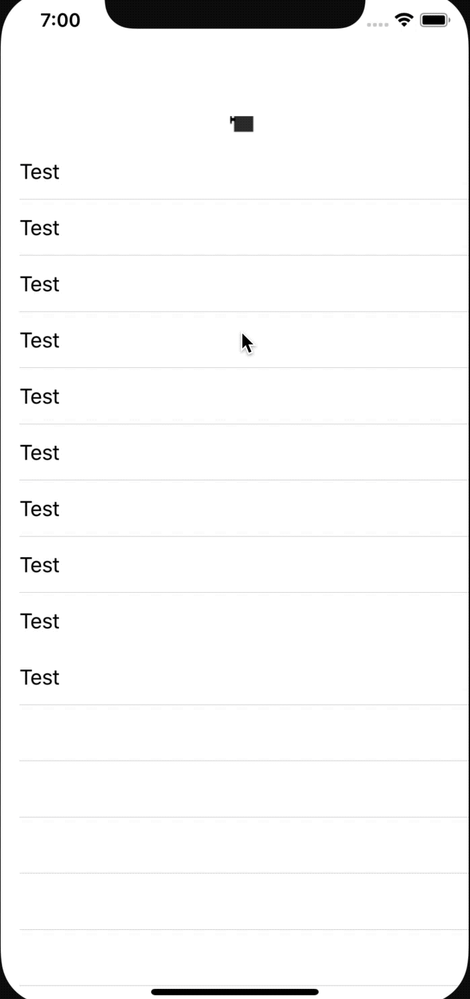

# DNRefreshKit

[](https://travis-ci.org/540563689@qq.com/DNRefreshKit)
[](https://cocoapods.org/pods/DNRefreshKit)
[](https://cocoapods.org/pods/DNRefreshKit)
[](https://cocoapods.org/pods/DNRefreshKit)

## Example

To run the example project, clone the repo, and run `pod install` from the Example directory first.

## Requirements
【用法 给TableView添加下拉刷新】 

导入头文件 `#import <DNRefreshKit/UIScrollView+Refresh.h>`

```

- (void)viewDidLoad
{
    [super viewDidLoad];
    [self.view addSubview:self.tabelView];
    
    @weakify(self)
    [self.tabelView tg_headerRefreshExecutingBlock:^{
        @strongify(self)
        dispatch_async(dispatch_get_main_queue(), ^{
            [self.tabelView tg_headerEndRefresh];
        });
    }];
}

```

【例如给UIColletionView添加上拉、下拉刷新】

```
// 下拉刷新
@weakify(self)
[self.collectionView tg_headerRefreshExecutingBlock:^{
        @strongify(self)
        self.newsListRequest.page = 1;
        [self.collectionView tg_footerEndRefresh];
        [self tg_loadData];
}];
    
[self.collectionView tg_footerRefreshExecutingBlock:^{
        @strongify(self)
        self.newsListRequest.page++;
        [self.collectionView tg_headerEndRefresh];
        [self tg_loadData];
}];    
```  
  【修改默认的下拉刷新的gif图标】
  
  * 在项目创建名为 `MMRefresh.bundle`资源文件夹
  * 命名图片为`loading.gif` 的图片拖入资源文件夹

  
  
  ### GIF的帧动画刷新
  
  * 在项目创建名为 `MMRefreshGif.bundle`资源文件夹
  * 将帧动画的一组图片拖入资源文件夹，必须以png后缀结尾
  
  * 设置 gifType 为 MMRereshGifTypeFrameAnimation
  * isChangeAlpha 表示执行gif下拉刷新时是否同时改变Alpha
  
  ```  
  [self.tabelView tg_headerRefreshExecutingBlock:^{
         dispatch_async(dispatch_get_global_queue(0, 0), ^{
             [NSThread sleepForTimeInterval:1];
             dispatch_async(dispatch_get_main_queue(), ^{
                  [self.tabelView tg_headerEndRefresh];
             });
         });
     } gifType:MMRereshGifTypeFrameAnimation isChangeAlpha:NO];
     
 ```   
 
  
## Installation

DNRefreshKit is available through [CocoaPods](https://cocoapods.org). To install
it, simply add the following line to your Podfile:

```ruby
pod 'DNRefreshKit'
```

## Author

540563689@qq.com, zhengjia@donews.com

## License

DNRefreshKit is available under the MIT license. See the LICENSE file for more info.


